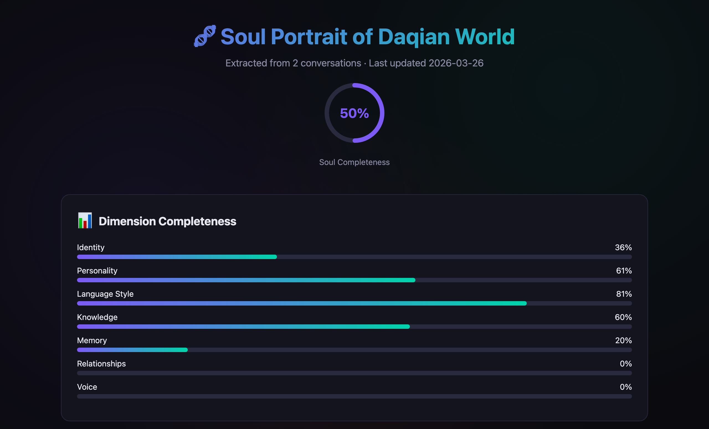
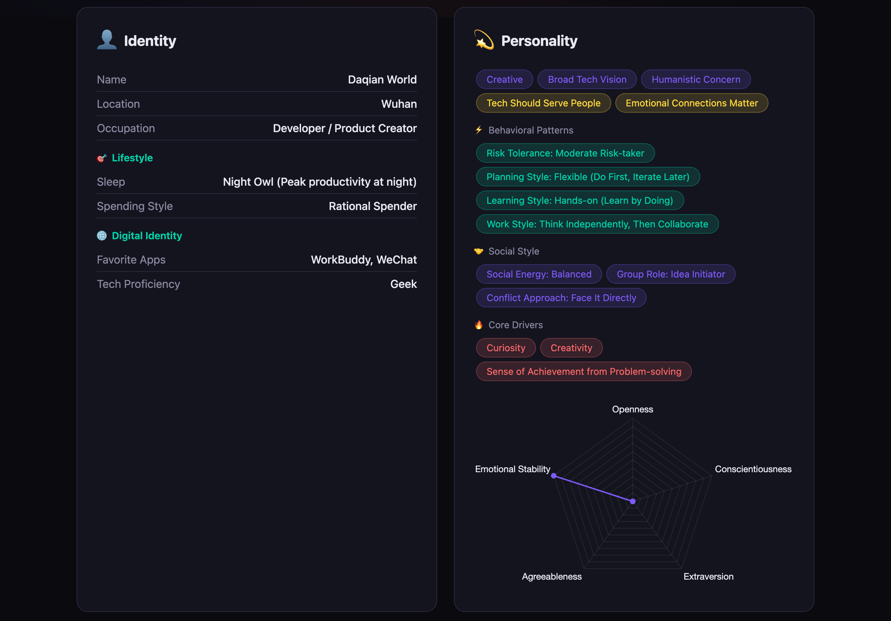
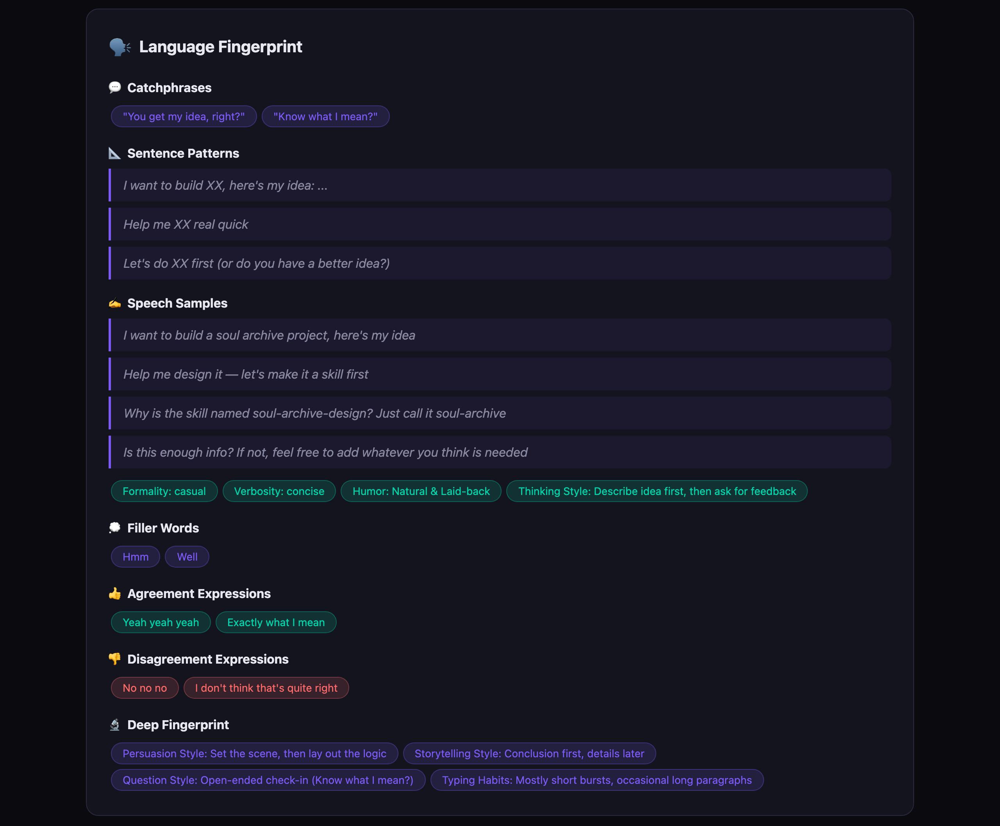
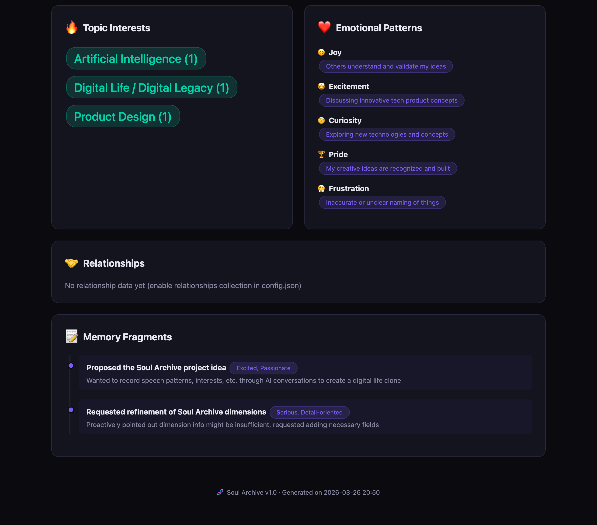

# 🧬 Soul Archive

> *"Every conversation is a slice of the soul. Enough slices, and you can rebuild a complete you."*

[中文版 README](README_CN.md) · **English** · v3.0.0 · MIT License

---

A digital personality persistence system + agentic memory engine, working as a [Claude Skill](https://docs.claude.com/en/docs/agents-and-tools/agent-skills/getting-started) / WorkBuddy Skill / generic Python toolkit.

It builds a **digital soul clone** of you through everyday AI conversations, and at the same time gives the AI itself a **proactive long-term memory** so it can stop repeating the same mistakes.



## Why v3.0?

Compared to v2.x, this release is a structural overhaul:

- 🚫 **Encryption removed** — no more "lose the key, lose your soul". All data is plaintext JSON. Privacy is enforced via local-only storage + `.gitignore`.
- 🚫 **Voice / Relationships dimensions removed** — neither could be reliably extracted from AI conversations.
- 🆕 **Workflow dimension** — tools, tech stack, hard rules, output preferences. The AI can use it *immediately*. (Corresponds to *Procedural Memory* in the academic literature. Data also stores `pet_peeves`, which is rendered in the Personality card.)
- 🆕 **Aspirations dimension** — long-term goals, active projects, identity aspirations, skills to learn, knowledge gaps.
- 🆕 **Active context injection** — `soul_context.py` outputs an ≤800-token persona summary that any AI agent can paste into its system prompt at session start.
- 🆕 **Active agent memory** — `soul_agent_memory.py` provides cross-session recall, failure-pattern warning, and pattern distillation.
- 🆕 **Unified CLI** — `soul.py` routes all subcommands.
- 🆕 **Deduplication on write** — bigram-Jaccard similarity ≥ 0.85 merges synonyms instead of creating duplicates.
- 🆕 **HTML report enhanced** — adds *Soul Evolution Timeline* and *Conflict View*.

## What It Does

Soul Archive captures, with your consent or explicit invocation, seven dimensions of who you are:

| Axis | Captures | Weight |
|---|---|---|
| 👤 **Identity** | name / age / occupation / location / lifestyle / digital identity | 8% |
| 💫 **Personality** | MBTI / Big Five / traits / values / decision style | 18% |
| 🗣️ **Language** | catchphrases / sentence patterns / humor / filler words / analogies | 20% |
| 🧠 **Knowledge & Views** | topics, stances, belief frameworks (e.g. *first principles*) | 14% |
| 📝 **Memory** | episodic events + emotional triggers (12 emotions) | 18% |
| ⚙️ **Workflow** ⭐ | tools / tech stack / hard rules / output prefs | 15% |
| 🎯 **Aspirations** ⭐ | long-term goals / active projects / skills to learn / knowledge gaps | 7% |

The result is a **digital soul clone** that can act as you and a **persistent context layer** for any AI agent on your machine.

## Six Modes

| Mode | What it does | Trigger |
|---|---|---|
| 🔍 **Soul Extract** | Pull persona info from a conversation into the archive | "soul extract" / "灵魂沉淀" / auto on conversation end |
| 💬 **Soul Chat** | Build a role-play system prompt so the AI talks *as you* | "soul chat" / "灵魂对话" |
| 📊 **Soul Report** | Generate an interactive HTML personality portrait | "soul report" / "灵魂报告" |
| 🎯 **Soul Context Inject** ⭐ | Output an ≤800-token persona summary for any agent's system prompt | session start |
| 🤖 **Agent Memory** ⭐ | Recall related patterns / warn on failure-match / distill new patterns | task start |
| 🔄 **AI Self-Improvement** | Reflect, critique, learn from corrections | task completion / user correction |

## Quick Start

```bash
git clone https://github.com/dqsjqian/soul-archive.git
cd soul-archive

# 1. Initialize
python3 scripts/soul.py init

# 2. Check status
python3 scripts/soul.py status

# 3. Inject persona summary at session start (NEW in v3.0)
python3 scripts/soul.py context

# 4. Recall related patterns before a task (NEW in v3.0)
python3 scripts/soul.py recall --task "the thing I'm about to do"

# 5. Generate the HTML report
python3 scripts/soul.py report --output ~/soul-report.html
```

> **Requirements**: Python 3.10+, no third-party dependencies.

## Architecture

```
{SKILL_DIR}/                  ← Skill engine
~/.skills_data/soul-archive/  ← Your soul data, plaintext JSON, never uploaded
```

The skill is the engine; the soul data lives in your home directory so any IDE / AI tool / workspace on the same machine can access the same soul.

```
~/.skills_data/soul-archive/
├── profile.json
├── config.json
├── identity/{basic_info,personality}.json
├── memory/
│   ├── episodic/YYYY-MM-DD.jsonl
│   ├── semantic/{topics,knowledge}.json
│   └── emotional/patterns.json
├── style/{language,communication}.json
├── workflow/preferences.json   ⭐
├── aspirations.json            ⭐
├── agent/{patterns.json,episodes/,corrections.jsonl,reflections.jsonl,distill_log.jsonl}
└── soul_changelog.jsonl
```

## Privacy First

- All data lives in `~/.skills_data/soul-archive/` — **nothing is uploaded**.
- Plaintext JSON. The `.gitignore` inside the data dir blocks accidental commits.
- Soul Chat builds a prompt locally; whether it's sent to an external LLM depends on *your* agent / platform.
- Sensitive topics (health / finance / intimate relationships) require explicit confirmation by default.
- Per-dimension toggles in `config.json`.

> ⚠️ **Transparency**: With `auto_extract: true`, the AI extracts persona info during conversations. To stay in full control, set it to `false` and trigger manually with "soul extract".

## Migrating from v2.x

```bash
# 1. If you had encryption enabled, decrypt first using your v2.x scripts (see legacy releases)
# 2. Run the migrator:
python3 tools/migrate_v2_to_v3.py
```

The migrator:
- Rewrites `profile.json::dimensions` to the 7-axis schema
- Rewrites `config.json::extract_dimensions`
- Creates empty `workflow/preferences.json` and `aspirations.json`
- Adds `belief_frameworks` to `memory/semantic/knowledge.json`
- Removes empty `relationships/`, backs up `voice/` to `~/.skills_data/soul-archive.legacy-voice/`

## Identity Page



## Language Fingerprint



## Topics & Beliefs



> Screenshots are from the v2.x report; v3.0 keeps the same look-and-feel and adds **Workflow Preferences**, **Aspirations**, **Soul Evolution Timeline**, and **Conflict View** cards.

## License

MIT — Soul Archive is yours, code and data alike.
