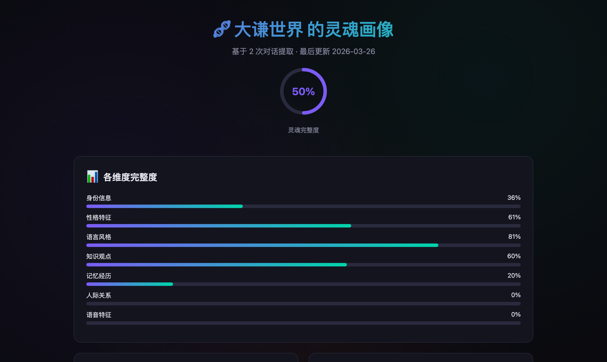
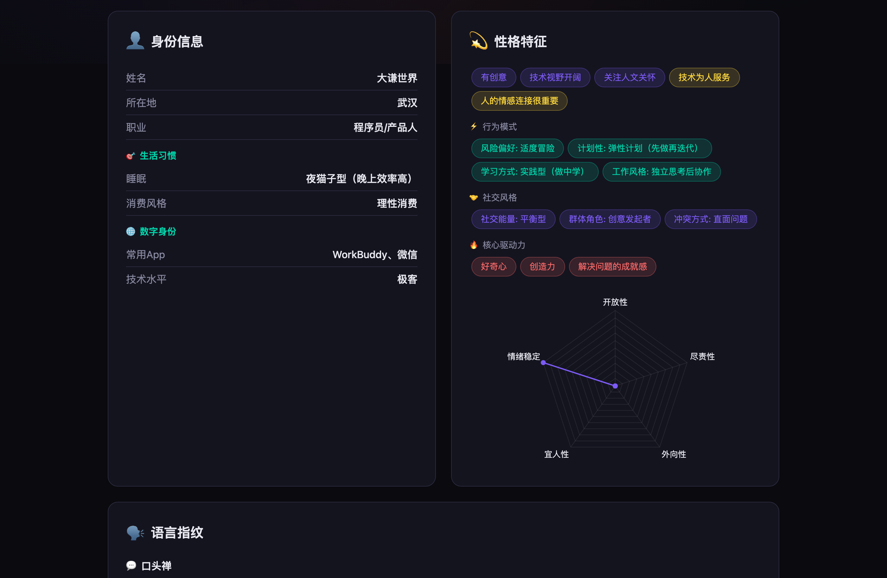
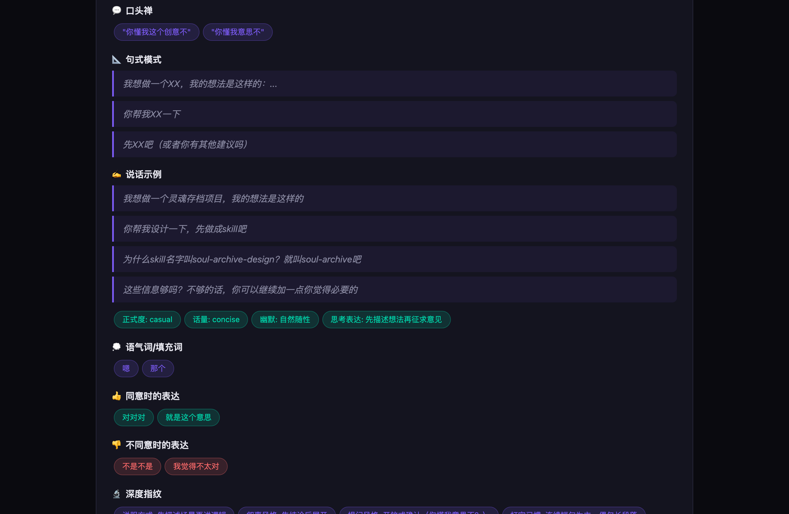
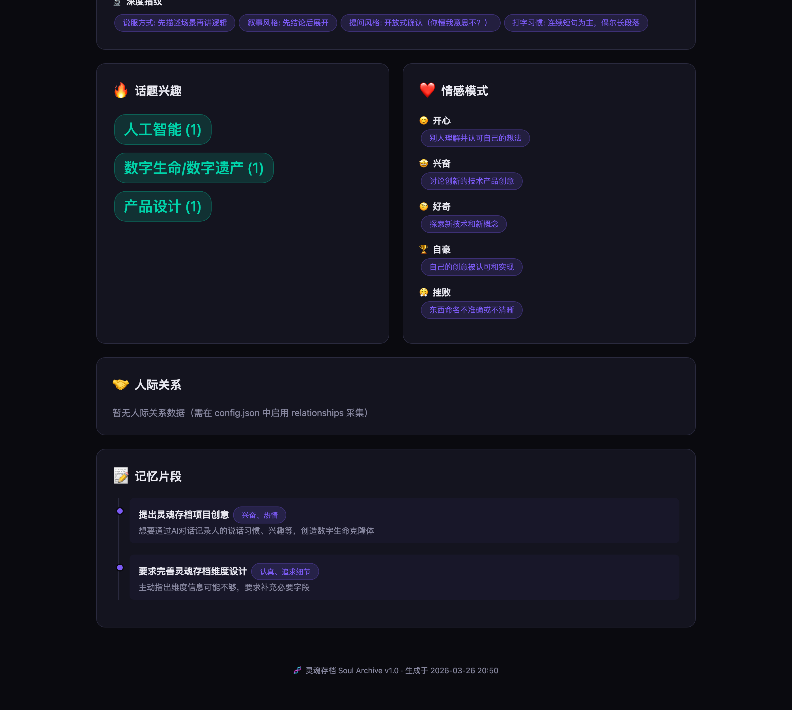

# 🧬 灵魂存档 Soul Archive

> *"每一次对话都是灵魂的切片。切片够多，就能拼出完整的你。"*

[English README](README.md) · **中文** · v3.0.0 · MIT License

---

数字人格持久化系统 + 主动智能体记忆引擎。可作为 [Claude Skill](https://docs.claude.com/en/docs/agents-and-tools/agent-skills/getting-started) / WorkBuddy Skill / 通用 Python 工具使用。

通过日常 AI 对话**沉淀你的数字灵魂副本**；同时给 AI 自己一份**主动的长期记忆**，让它别再重复同样的错误。



## v3.0 有什么变化

相比 v2.x 是一次**结构性重构**：

- 🚫 **移除加密层** —— 不再有"丢密钥即丢数据"的风险。全部明文 JSON。隐私通过本地存储 + `.gitignore` 保证。
- 🚫 **移除 Voice / 人际关系维度** —— 在 AI 对话场景里两者都难以可靠采集。
- 🆕 **新增 Workflow 维度** —— 工具/技术栈/硬规则/输出偏好。AI 立刻就能用。（对应学界的 *Procedural Memory*。`pet_peeves`/反感的事 数据也存在这里，但 HTML 报告里渲染在「性格特征」卡尾部）
- 🆕 **新增 Aspirations 维度** —— 长期目标 / 在做的项目 / 想成为的样子 / 想学的技能 / 认知盲区。
- 🆕 **主动上下文注入** —— `soul_context.py` 输出 ≤800 token 的人格摘要，任意 AI agent 在对话开始时拼到 system prompt 即可。
- 🆕 **主动智能体记忆** —— `soul_agent_memory.py` 提供：跨会话召回、失败模式预警、行为模式蒸馏。
- 🆕 **统一 CLI** —— `soul.py` 路由全部子命令。
- 🆕 **写入去重** —— 用 bigram-Jaccard 相似度（默认 ≥0.85）合并同义条目，告别重复。
- 🆕 **HTML 报告增强** —— 新增"灵魂演变时间线"和"档案冲突"视图。

## 它做什么

灵魂存档在你授权或显式触发下，采集你的 7 个维度：

| 维度 | 内容 | 权重 |
|---|---|---|
| 👤 **身份** | 名字 / 年龄 / 职业 / 所在地 / 生活习惯 / 数字身份 | 8% |
| 💫 **性格** | MBTI / 大五人格 / 特质 / 价值观 / 决策风格 | 18% |
| 🗣️ **语言风格** | 口头禅 / 句式 / 用词 / 幽默 / 语气词 / 类比 | 20% |
| 🧠 **知识与观点** | 关注的话题、立场、信奉的方法论框架（如"第一性原理"） | 14% |
| 📝 **记忆** | 情景记忆 + 12 种情绪触发 | 18% |
| ⚙️ **工作偏好** ⭐ | 工具 / 技术栈 / 硬规则 / 输出偏好 | 15% |
| 🎯 **理想抱负** ⭐ | 长期目标 / 在做的项目 / 想学的技能 / 认知盲区 | 7% |

最终成果：一个**数字灵魂副本** + 一份**任意 AI agent 都能加载的人格上下文层**。

## 六大模式

| 模式 | 做什么 | 触发 |
|---|---|---|
| 🔍 **灵魂沉淀** | 从对话中提取人格信息 | "灵魂沉淀" / 对话结束自动 |
| 💬 **灵魂对话** | 构建角色扮演 prompt，让 AI 以你的身份说话 | "灵魂对话" |
| 📊 **灵魂报告** | 生成交互式 HTML 人格画像 | "灵魂报告" |
| 🎯 **上下文注入** ⭐ | 输出 ≤800 token 的人格摘要供 agent 加载 | 会话开始 |
| 🤖 **智能体记忆** ⭐ | 召回相关模式 / 失败预警 / 蒸馏新模式 | 任务开始 |
| 🔄 **AI 自我改进** | 反思、自我批评、从纠正中学习 | 任务完成 / 用户纠正 |

## 快速开始

```bash
git clone https://github.com/dqsjqian/soul-archive.git
cd soul-archive

# 1. 初始化
python3 scripts/soul.py init

# 2. 查看状态
python3 scripts/soul.py status

# 3. 在 AI 对话开始时注入人格摘要 (v3.0 新)
python3 scripts/soul.py context

# 4. 任务执行前查相关模式 (v3.0 新)
python3 scripts/soul.py recall --task "我现在要做的事"

# 5. 生成 HTML 报告
python3 scripts/soul.py report --output ~/soul-report.html
```

> **依赖**：仅需 Python 3.10+，零第三方依赖。

## 架构

```
{SKILL_DIR}/                  ← Skill 引擎
~/.skills_data/soul-archive/  ← 你的灵魂数据，明文 JSON，绝不上传
```

引擎是 Skill；数据放在用户主目录，所以同机器上任何 IDE / AI 工具 / Workspace 都能访问同一份灵魂。

```
~/.skills_data/soul-archive/
├── profile.json
├── config.json
├── identity/{basic_info,personality}.json
├── memory/
│   ├── episodic/YYYY-MM-DD.jsonl
│   ├── semantic/{topics,knowledge}.json
│   └── emotional/patterns.json
├── style/{language,communication}.json
├── workflow/preferences.json   ⭐
├── aspirations.json            ⭐
├── agent/{patterns.json,episodes/,corrections.jsonl,reflections.jsonl,distill_log.jsonl}
└── soul_changelog.jsonl
```

## 隐私优先

- 全部数据在 `~/.skills_data/soul-archive/` —— **不上传任何云端**。
- 明文 JSON。数据目录的 `.gitignore` 拦截误提交。
- Soul Chat 在本地构建 prompt；是否被外部 LLM 看到取决于你的 agent / 平台。
- 默认敏感话题（健康、财务、亲密关系）需用户确认。
- `config.json` 提供每个维度的开关。

> ⚠️ **透明度**：开启 `auto_extract: true` 时，AI 会在对话中提取人格信息。完全控制需 `auto_extract: false`，并以触发词手动激活。

## 从 v2.x 迁移

```bash
# 1. 如果你之前启用了加密，请先用 v2.x 配套脚本解密
# 2. 然后运行迁移工具：
python3 tools/migrate_v2_to_v3.py
```

迁移工具会：
- 把 `profile.json::dimensions` 重写为 7 维（去掉 voice / relationships）
- 重写 `config.json::extract_dimensions`
- 创建空的 `workflow/preferences.json` 和 `aspirations.json`
- 给 `memory/semantic/knowledge.json` 加 `belief_frameworks` 字段
- 删除空的 `relationships/`，备份 `voice/` 到 `~/.skills_data/soul-archive.legacy-voice/`

## 截图

### 身份卡



### 语言指纹



### 话题与观点



> 截图来自 v2.x 报告；v3.0 保留同样的视觉风格，新增 **工作偏好**、**理想抱负**、**灵魂演变时间线**、**档案冲突** 四个 card。

## License

MIT —— 灵魂存档是你的，代码和数据都是。
